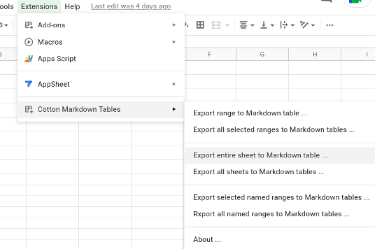
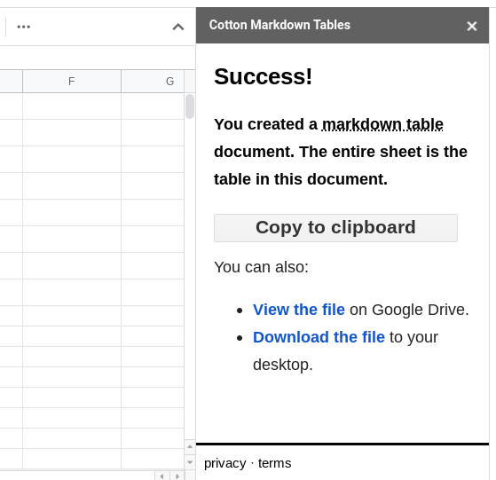

# Cotton Markdown Tables: Export Markdown tables from Google Sheets

![Cotton Markdown Tables icon is colon-dash-dash-colon][icon120]

The **Cotton Markdown Tables** add-on for Google Sheets improves data sharing workflows. Build rich, informative spreadsheets. Then, export them to Markdown table syntax with a few clicks.

  + [INSTALL](#install)
  + [PERMISSIONS](#permissions)
  + [FEATURES](#features)
  + [PRIVACY POLICY](#privacy-policy)
  + [TERMS OF SERVICE](#terms-of-service) 
  + [COMPLIANCE](#compliance) 
  + [DISCLAIMERS](#disclaimers)  
  + [OPEN SOURCE](#open-source)

## INSTALL

### Google Workspace Marketplace

  + [Install the Cotton Markdown Tables][g_cotton] add-on from the Google Workspace Marketplace.
  + [https://workspace.google.com/marketplace/app/cotton_markdown_tables/734474805574][g_cotton]

### More Options

  + There are [more installation options available][gh_mdt] for this add-on.

## PERMISSIONS

In order to provide useful features, this add-on requires permissions from you. The following describes the purpose of permissions for this add-on:

  + **Google Drive:** 
    + *"See, edit, create, and delete all of your Google Drive files"*
    + This permssion allows the add-on to create a `Cotton Markdown Tables` folder and save Markdown table documents on your Google Drive. Additionally, this feature allows the add-on to jump directly to the saved Markdown file or download the Markdown file to your desktop. No user data sent to pffy-cloud.

  + **Google Sheets:**
    + *"View and manage spreadsheets that this application has been installed in"*
    + This permssion allows the add-on to only read the content of the spreadsheet that is currently open. Reading this information helps the add-on determine how to convert betweeen spreadsheet formatting and Markdown syntaxes. No user data sent to pffy-cloud.
 
  + **Script UI:**
    + *"Display and run third-party web content in prompts and sidebars inside Google applications"*
    + This permssion allows the add-on to provide user interaction for better usability. HTML, CSS, JavaScript and frameworks (e.g., jQuery) are implemented in the sidebar to help the add-on copy text to your clipboard, view saved files in your Google Drive, or download saved files to your desktop. No user data sent to pffy-cloud.

### Remove permissions

Permissions [can be removed][revoke] at any time from your Google Account.

## FEATURES

> **NOTE:** [What's new](https://m.pffy.dev/cotton-whats-new) in this version?

### Export options

You have six options for exporting data from Google Sheets to Markdown tables:

  1. **Export active range:** The most basic selection in a spreadsheet.
  2. **Export all active ranges:** This allows you to multi-select seperate ranges and export all the converted tables into a single Markdown table document.
  3. **Export entire sheet:** This method includes all the data within a sheet without user selection.
  4. **Export all sheets:** This method exports each sheet in the spreadsheet and places them into a single document.
  5. **Export selected named ranges:** Choose which predefined named ranges you want and save all the generated Markdown tables in a single Markdown document.
  6. **Export all named ranges:** Combine all the named ranges in a spreadsheet into a single Markdown document.

### Deliverables 

After you export Markdown tables with Cotton, you have three deliverables. 

You can:

  * Copy the Markdown text to clipboard
  * View the Markdown file in Google Drive
  * Download the Markdown file to your desktop

## YouTube Channel

  + [Cotton Markdown Tables on YouTube][yt_cotton]

## Privacy Policy

This add-on complies with the [Google API Services User Data Policy][gapi]. Additionally, we are committed to exceeding these requirements while delivering wonderful user experiences, without collecting any personally-identifying information about you. These efforts are described with greater detail in our privacy policy:

  + [https://a.pffy.dev/about/privacy][privacy]

## Terms of Service

  + [https://a.pffy.dev/about/terms][terms]

## Compliance

This section is for compliance departments within companies, agencies or organizations that must provide documentation of licensing for internal or external audit processes.

**The Cotton Markdown Tables spreadsheet editor add-on is free software.** Printing this web page (either as paper for PDF) and retaining a copy for your records is sufficient documentation for your organization's site license or domain license.

## Disclaimers

Google Sheets, Google Drive, and other Google software or features are trademarks of Google, an Alphabet company. jQuery belongs to the OpenJS Foundation and jQuery contributors.

## Open Source

Source code for this free software is available here on GitHub:

  + https://github.com/pffy/markdown-table/

[gh_mdt]: https://github.com/pffy/markdown-table/blob/main/README.md#install
[g_cotton]: https://workspace.google.com/marketplace/app/cotton_markdown_tables/734474805574?utm_source=m-pffy-dev
[yt_cotton]: https://www.youtube.com/channel/UCl7X-xNklgG6Eg5X91TNn2Q
[icon120]: /png/icon-simple-120.png
[revoke]: https://myaccount.google.com/permissions
[terms]: https://a.pffy.dev/about/terms
[privacy]: https://a.pffy.dev/about/privacy
[gapi]: https://developers.google.com/terms/api-services-user-data-policy#additional_requirements_for_specific_api_scopes


